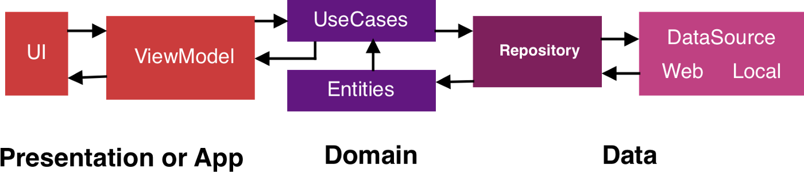

# Android MVVM plus clean Architecture

## Why MVVM with Clean Architecture?

MVVM includes Model, View and ViewModel and in addition to this, Clean architecture has one more layer which is USE CASES.

In MVVM, we use to put all our business logic into our ViewModels but the problem with that is, the bigger your project gets, the more number of ViewModels you have and all your business logic is divided into various viewModels. That’s where clean architecture comes into the picture, we use USE CASES instead of ViewModels for all our Business logic.

## UseCase

Use case is an action we can do within a feature.

For ex. We have feature called “News” which can have actions such as

Getting Latest News
Getting Top News

## Advantages of Use Cases :

### Helps removing code Duplication : 
Now if we want to get Latest News data in two different ViewModels, we can easily call one method from our USE_CASE class instead of putting the same method in two separate ViewModels.

### Screaming Architecture : 
The term “screaming architecture” is used when we can, just by looking at a new project at a glance, get the core idea of what the project does and what it is about. Similarly, Use Case should be made in a way that anyone can understand just by looking at the class name that what it does . For ex. GetNewsUseCase is used to get list of news from a data source.

